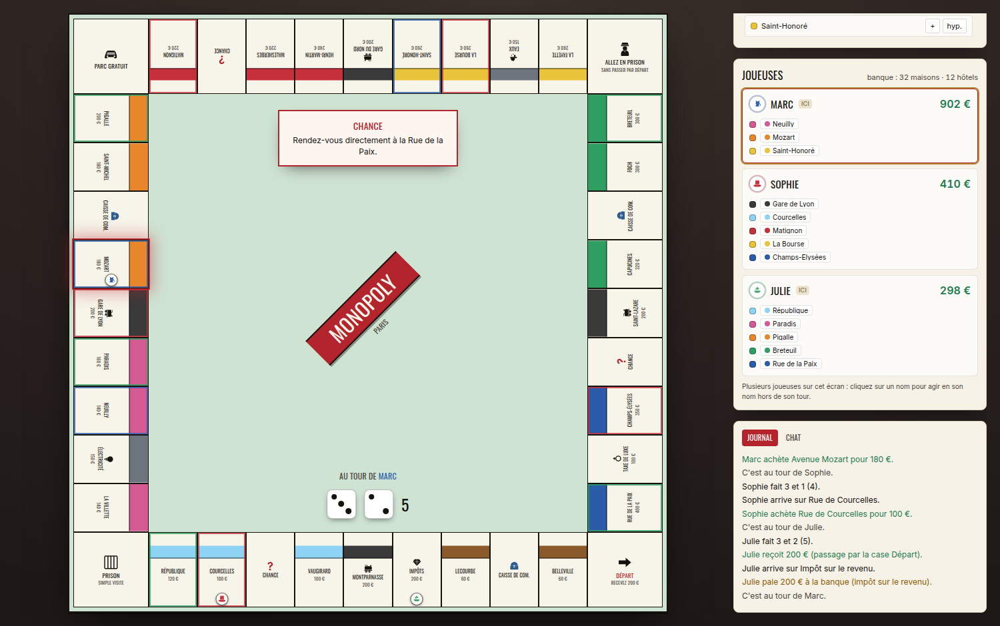

# Monopoly — la plateforme multijoueur en temps réel

Plusieurs boîtes de Monopoly, jouables à 2-6 depuis un navigateur, sur le même
wifi ou à distance.

**Le jeu est complet et jouable** : plateau, règles, temps réel, lobby, échanges,
chat, reconnexion. On peut jouer **à plusieurs sur le même ordinateur**, avec
d'autres joueuses **à distance** dans la même partie. Les trois extensions Hasbro
2025 sont activables à la création de la partie (Parc Gratuit Jackpot, Prison,
Tout Acheter). 175 tests automatisés.

## Les éditions

Chacune a son plateau, ses pions, ses cartes, ses couleurs et sa matière — et,
quand la boîte le demande, **ses règles**.

| Édition | Monnaie | Plateau | Règles |
|---|---|---|---|
| **Monopoly Classique** | € | carton vert de table | la référence — vingt pions au choix |
| **Harry Potter — Gallions** | G | parchemin, Carte du Maraudeur | comme le classique, noms de Poudlard |
| **Marvel Avengers** | M$ | acier et néons | bases S.H.I.E.L.D. et quartiers généraux Stark |
| **Spider-Man — Collector** | $ | nuit d'encre, toile tendue, pans rouge et bleu | comme le classique : on capture les vilains, on pose traceurs et tours de toile |
| **Spider-Man — Bouffon Vert** | $ | nuit d'encre, toile tendue, pans rouge et bleu | **règles Hasbro** : chaque joueuse a un héros et son pouvoir, un pion hostile avance tout seul et sème des bombes, des raccourcis de toile traversent le plateau |
| **Harry Potter — Coupe des Quatre Maisons** | points | ciel de nuit, Grande Salle | **règles Hasbro** : pas d'hôtel, pas d'hypothèque, personne n'est éliminée, on gagne en explorant tout le plateau |

Au moment de créer une partie, on choisit sa boîte **et sa langue** : français ou
anglais. La langue ne change que les mots — jamais un prix, jamais une règle.

Sur l'édition Classique, trois **extensions Hasbro** sont activables à la
création de la partie :

- **Parc Gratuit Jackpot** — Chance et Caisse de communauté deviennent des cases
  Spin, la cagnotte du Parc Gratuit devient permanente.
- **Prison** — les cases taxes envoient en prison, une geôle plus sévère
  apparaît, trois doubles n'y mènent plus.
- **Tout Acheter** — Départ, Prison et Parc Gratuit deviennent achetables, un
  coffre de cartes Vente reste retourné au centre, un dé d'Achat facultatif
  permet d'en gagner, et toute case dépassée sans s'y arrêter part aux enchères.

Certaines se marchent sur les mêmes cases et ne peuvent donc pas s'activer
ensemble — l'écran de sélection le détecte tout seul et grise ce qui ne va pas
avec ce qui est déjà coché. Prison + Tout Acheter est la combinaison à deux
autorisée.



## Démarrage

```bash
npm install
npm run build   # compile l'interface — à refaire après chaque `git pull`
npm start       # http://localhost:3000 — l'adresse à partager s'affiche au démarrage
npm run check   # lint + 175 tests : données, éditions, extensions, langues, règles, parties simulées, temps réel
```

Node 22+. Le serveur affiche aussi l'adresse locale (`http://192.168.x.x:3000`) à
donner aux autres joueuses du même wifi.

## Structure

```
shared/          données de jeu + schéma d'état, partagés serveur ↔ client
  editions.js    catalogue des boîtes + surcouche de langue
  editions/<id>/ board.json, groups.json, cards.json, edition.json, locales/en.json
  messages.js    les phrases du journal, en français et en anglais
  schema.js      typedefs de l'état + fabriques d'état initial
server/
  engine/        moteur : tour, déplacements, loyers, cartes, enchères, faillite
  index.js       serveur HTTP + API, sert le client compilé
  sockets.js     passerelle Socket.io ↔ moteur
  rooms.js       registre des parties, codes, sauvegarde sur disque
client/          interface React + Vite + Tailwind
  src/components/  plateau et son décor, joueuses, actions, échanges, journal, chat
  src/lib/         connexion temps réel, état, données du plateau, thème, langues
tests/           data / editions / engine / locales / payment-flow / points-edition / server / simulation
docs/            DATA_MODEL.md, MOTEUR.md, SERVEUR.md, CLIENT.md, ART_DIRECTION.md
CLAUDE.md        carnet de bord : architecture, pièges, ce qui reste à faire
```

**Ajouter une édition = déposer un dossier** dans `shared/editions/`, le déclarer
dans `shared/editions.js`, dessiner les pions manquants. Aucune ligne de moteur
ne bouge — et `tests/editions.test.js` joue une partie entière sur la nouvelle
boîte pour le vérifier.

## Stack retenue

React + Vite + Tailwind côté client, Node + Express + Socket.io côté serveur,
état en mémoire côté serveur. C'est bien la stack proposée dans le cahier des
charges, avec deux ajustements pensés pour un groupe non technique :

- **un seul processus, un seul port** : Express sert le build du client *et* le
  websocket. Une seule commande à lancer (`npm start`), une seule URL à partager,
  pas de CORS à régler ;
- **snapshot JSON sur disque** plutôt que SQLite : l'état est déjà 100 %
  sérialisable, donc une sauvegarde toutes les N mutations dans un fichier suffit
  à survivre à un redémarrage. On passera à SQLite seulement si on veut plusieurs
  parties archivées.

## Direction artistique

**Chaque boîte a son plateau.** Le carton vert de table pour le classique, un
parchemin à l'encre sépia pour Harry Potter, un ciel de nuit doré pour la Coupe
des Quatre Maisons, de l'acier et des néons pour les Avengers : matière, cadre,
filigrane, blason central et illustration de chaque case changent avec
l'édition. Tout est dessiné en SVG à la main — rien à télécharger, le jeu tourne
hors ligne. Détails dans `docs/ART_DIRECTION.md`.

## Jouer ensemble

1. Une personne lance `npm start` sur son ordinateur et ouvre `http://localhost:3000`.
2. Elle crée une partie, choisit son pion, et **ajoute autant de joueuses qu'elle
   veut sur ce même ordinateur** (bouton « + Ajouter une joueuse sur cet
   ordinateur »). On se passe simplement la souris : le jeu annonce à chaque tour
   à qui c'est.
3. Pour les joueuses à distance, elle partage l'adresse affichée au démarrage
   (`http://192.168.x.x:3000`) si tout le monde est sur le même wifi, ou un tunnel
   (ngrok, Cloudflare Tunnel) sur le port 3000 sinon, et dicte le code à six
   lettres.
4. Quand tout le monde est là, **n'importe qui** lance la partie.

Les deux modes se mélangent : trois personnes autour d'un portable et deux autres
à distance, dans la même partie.

Fermer un onglet par erreur ne fait rien perdre : rouvrir la page reprend la
partie au même point.

**On peut s'arrêter et reprendre un autre jour.** La partie est sauvegardée à
chaque coup et survit à l'extinction du PC. L'écran d'accueil liste les parties en
cours avec leurs pions et le tour atteint : on tape son pseudo, on clique dessus,
et on repart où l'on s'était arrêtées. Rien n'est effacé avant un mois sans jouer.

Et si l'envie de finir n'y est plus, **n'importe qui** peut terminer la partie
depuis la barre du haut. Le **compte final** s'ouvre alors au milieu de l'écran,
chez tout le monde en même temps : le podium, le détail de chacune (liquide,
propriétés, constructions), les éliminées en bas de tableau. De là, un bouton
ramène à l'accueil pour en relancer une — ou on referme pour regarder le plateau
une dernière fois, le compte reste accessible depuis la barre du haut.

## Sur téléphone comme sur ordinateur

**Sur ordinateur**, le plateau occupe la gauche, tout le reste la droite : on
voit la partie entière d'un seul coup d'œil, sans onglet.

**Sur téléphone**, trois onglets, et le premier suffit pour jouer : l'onglet
**Jeu** montre le plateau *et* les boutons — on lance les dés, on voit la case
où l'on tombe, on achète, on paie, sans jamais changer d'écran. L'onglet
**Profil** sert à regarder ses biens à tête reposée, l'onglet **Journal** à
relire ce qui s'est passé.

## Conçu pour se jouer en se parlant

On joue en vocal, ou dans la même pièce. Le jeu n'essaie donc pas de remplacer la
conversation ni de départager qui a le droit de faire quoi :

- **aucune commande réservée à une seule personne** — lancer la partie, changer
  les règles maison, arrêter la partie : la première qui a la souris clique, une
  fois que le groupe s'est mis d'accord à l'oral ;
- **le journal note qui a fait quoi**, ce qui suffit largement entre amies ;
- **les négociations se règlent de vive voix**, l'écran ne sert qu'à exécuter
  l'accord : on saisit l'échange, l'autre accepte d'un clic, à tout moment ;
- le **chat** reste là pour noter un montant ou un accord, sans être le canal
  principal.

Le seul verrou conservé est celui qui protège le jeu lui-même : on ne peut pas
lancer les dés à la place d'une autre, ni acheter pendant son tour.

## Le rythme d'une vraie partie

- Les dés roulent d'abord, **le pion ne part qu'ensuite**, case par case.
- Les deux tas de cartes sont posés au centre : quand on tombe sur Chance ou
  Caisse de Communauté, **on pioche soi-même**, on lit la carte retournée en
  grand, puis on l'applique.
- L'argent s'affiche **en billets**, et on compose ses paiements en posant les
  coupures qu'on veut donner.

## Négocier plutôt que payer

**Un loyer n'est jamais prélevé d'office.** Quand on tombe chez quelqu'un, la
somme devient une dette, et on choisit :

- payer comptant — les billets à sortir sont affichés ;
- hypothéquer ou revendre ses constructions ;
- **négocier avec n'importe qui** pour réunir des fonds, puis payer ;
- **proposer un arrangement à la propriétaire** : un terrain, deux terrains, un
  peu d'argent, un mélange des deux. Si elle accepte, **la dette est effacée**,
  quel que soit le montant cédé. C'est aux deux de juger si le marché est bon ;
- déclarer faillite, en dernier recours.

Une proposition se répond **à tout moment**, sans attendre son tour. Sur un écran
partagé, les offres adressées à n'importe quelle joueuse du poste sont visibles
et répondables tout de suite.

## Pistes si l'envie vient

- Relire les trois extensions contre les boîtes physiques : les règles de
  Prison et de Tout Acheter viennent de sources secondaires, pas des livrets
  officiels (voir CLAUDE.md §5)
- Relire l'édition **Bouffon Vert** contre la boîte physique : deux de ses
  règles sont des lectures assumées, et les chiffres que la boîte ne donne pas
  (pénalité d'une bombe, prix d'un raccourci) ont été calibrés à la simulation
  — voir CLAUDE.md §5 bis
- Junior, Cheaters, Empire, Speed — les drapeaux de mécaniques correspondants
  existent déjà dans `edition.mechanics`
- Sauvegarde longue durée en SQLite plutôt qu'en fichiers JSON
- Statistiques de fin de partie (patrimoine, loyers encaissés)
