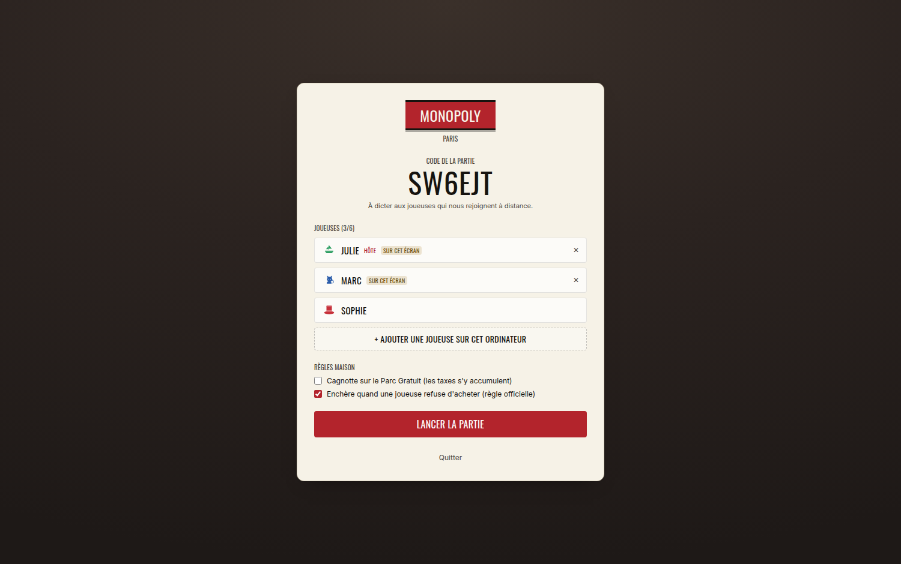

# Le client

React + Vite + Tailwind, direction artistique **« Plateau de table »** (voir `ART_DIRECTION.md`).

```bash
npm run build      # produit client/dist, servi par le serveur de jeu
npm run dev:client # Vite sur 5173, avec proxy vers le serveur sur 3000
```




## Structure

| Fichier | Rôle |
|---|---|
| `App.jsx` | aiguillage accueil / lobby / partie, fenêtres modales |
| `lib/useGame.js` | état reçu du serveur, reconnexion automatique |
| `lib/socket.js` | connexion Socket.io et mémoire locale de la session |
| `lib/board.js` | données du plateau et placement dans la grille 11 × 11 |
| `components/Board.jsx` | plateau, cases, pions animés, centre (logo, dés, carte) |
| `components/Players.jsx` | soldes et propriétés regroupées par couleur |
| `components/Actions.jsx` | barre d'action contextuelle et gestion du patrimoine |
| `components/TradeDialog.jsx` | construction et réponse aux échanges |
| `components/Feed.jsx` | journal de partie et chat, en deux onglets |
| `components/Dice.jsx` | deux dés animés |
| `components/TokenIcon.jsx` | les six pions dessinés en SVG |
| `components/SpaceIcons.jsx` | pictogrammes des cases (gare, ampoule, coffre…) |

## Plusieurs joueuses sur un écran

`useGame` renvoie `mine` (les joueuses de ce poste) et `me` (celle qui agit au
clic). `me` est choisie automatiquement : celle du poste à qui le jeu demande
quelque chose, sinon celle sélectionnée à la main dans le panneau des joueuses.

Quand plusieurs personnes partagent l'écran, un bandeau rappelle à qui passer la
souris, et les joueuses locales portent une étiquette « ici ». Pour agir hors de
son tour (hypothéquer, répondre à un échange), il suffit de cliquer sur son nom
dans le panneau.

## Principes

**Le client ne décide rien.** Il affiche `state.pending` et propose exactement les
boutons correspondants. Si un bouton apparaissait à tort, le moteur refuserait
l'action et renverrait un message d'erreur — l'affichage est une commodité, pas
une garantie.

**Les données du plateau viennent de `shared/`**, importées directement : prix et
loyers affichés sont ceux que le serveur applique, sans recopie.

**Une seule feuille de style pour l'ambiance.** Toutes les couleurs passent par des
variables dans `styles.css` : basculer sur la piste « Papier & Encre » ne demande
pas de toucher aux composants.

## Détails d'interface

- Plateau en grille 11 × 11 avec les quatre coins agrandis, `aspect-ratio: 1` —
  il ne se déforme jamais, et sur grand écran il occupe toute la hauteur pendant
  que la colonne de droite défile toute seule.
- Déplacement des pions **case par case** (90 ms), sauf pour un recul ou un envoi
  en prison, faits d'un coup — avancer 37 cases pour reculer de 3 serait absurde.
- Lancer de dés animé (550 ms) côté client, sur un tirage venu du serveur : tout
  le monde voit le même résultat. Le dernier jet reste affiché jusqu'au suivant.
- Halo doré sur la case active, liseré à la couleur de la propriétaire sur chaque
  case possédée, pastilles vertes pour les maisons, carré doré pour l'hôtel.
- Journal coloré par type d'événement, chat dans le second onglet.
- Clic sur n'importe quelle case : sa fiche complète (prix, loyers, hypothèque).

## Polices

Oswald, Inter et Cormorant Garamond sont **embarquées dans le build** (paquets
`@fontsource`), pas chargées depuis Google Fonts : une soirée sur un wifi sans
internet garde la même typographie, et aucune requête ne part vers l'extérieur.

## Accessibilité et confort

- `prefers-reduced-motion` désactive toutes les animations.
- Chiffres en chasse tabulaire : les montants ne dansent pas quand ils changent.
- Bandeau d'alerte si la connexion tombe, avec reprise automatique.
